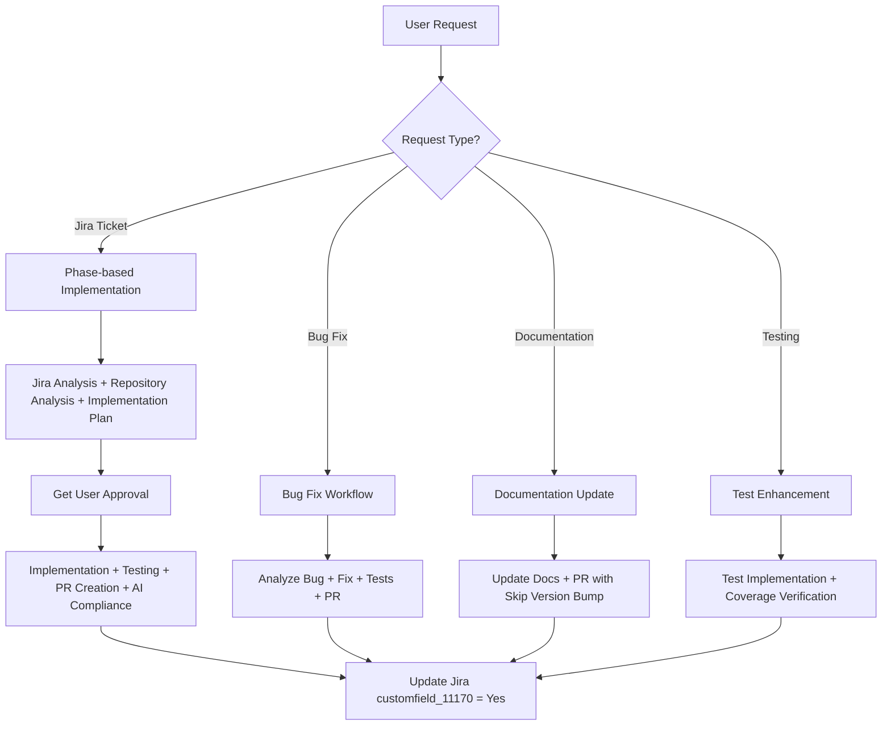

# GitHub Copilot Instructions for knife-azure

This document provides comprehensive guidance for GitHub Copilot when working with the knife-azure repository. Follow these instructions meticulously to ensure high-quality contributions, proper testing coverage, and seamless integration with the existing Chef ecosystem.

## ⚡ Quick Start for GitHub Copilot

### 🎯 CRITICAL SUCCESS FACTORS
1. **>80% Test Coverage** - NON-NEGOTIABLE for all code changes
2. **AI Compliance** - ALL PRs MUST include `ai-assisted` label and Jira field updates
3. **DCO Signoff** - ALL commits MUST be signed off (`git commit --signoff`)
4. **knife Plugin Architecture** - Extends [chef/knife](https://github.com/chef/knife) with Azure functionality

### 🚀 PRIMARY WORKFLOWS
- **Feature Implementation**: [Phase-based workflow](#development-workflow-integration) with Jira integration
- **Testing**: [RSpec framework](#testing-requirements-critical) with comprehensive coverage
- **PR Creation**: [Automated process](#pull-request-creation-process) with AI compliance
- **Code Quality**: [Chefstyle standards](#code-quality--standards) with Ruby best practices

### 🤖 COPILOT DECISION TREE



#### 🔍 When to Use Each Workflow:
- **Jira Ticket (PROJ-XXX)**: Use full phase-based workflow with comprehensive analysis
- **Bug Fix**: Focus on root cause analysis, regression tests, and priority labeling
- **Documentation**: Use expeditor skip labels, focus on clarity and accuracy
- **Testing**: Ensure >80% coverage, comprehensive test scenarios
- **Emergency**: Use expeditor skip all, focus on critical fixes

## Table of Contents

1. [Repository Overview & Structure](#repository-overview--structure)
2. [Development Workflow Integration](#development-workflow-integration)
3. [Testing Requirements (CRITICAL)](#testing-requirements-critical)
4. [Pull Request Creation Process](#pull-request-creation-process)
5. [AI-Assisted Development & Compliance](#ai-assisted-development--compliance)
6. [DCO (Developer Certificate of Origin) Compliance](#dco-developer-certificate-of-origin-compliance)
7. [Build System Integration](#build-system-integration)
8. [Label Management System](#label-management-system)
9. [Prompt-Based Execution Protocol](#prompt-based-execution-protocol)
10. [Repository-Specific Guidelines](#repository-specific-guidelines)
11. [Code Quality & Standards](#code-quality--standards)
12. [Security and Compliance Requirements](#security-and-compliance-requirements)
13. [Build & Development Environment](#build--development-environment)
14. [Integration & Dependencies](#integration--dependencies)
15. [Release & CI/CD Awareness](#release--cicd-awareness)
16. [Code Ownership & Review Process](#code-ownership--review-process)
17. [Ruby-Specific Guidelines](#ruby-specific-guidelines)
18. [Example Workflow Execution](#example-workflow-execution)

---

## Repository Overview & Structure

### Project Purpose
knife-azure is a Chef knife plugin that enables creation, deletion, and management of Microsoft Azure resources through Chef Infra. It extends the core knife tool (maintained in the [chef/knife](https://github.com/chef/knife) repository) with Azure-specific functionality, providing seamless integration between Chef's infrastructure automation and Azure's cloud platform.

### Plugin Architecture
- **Core Tool**: Built as an extension to the knife command-line tool from chef/knife
- **Plugin Type**: Standalone gem that integrates with knife's plugin system
- **Installation**: Distributed as a separate gem (`knife-azure`) that extends knife functionality
- **Integration**: Follows knife's plugin conventions and extends `Chef::Knife` base classes

### Technology Stack
- **Primary Language**: Ruby (3.1+)
- **Testing Framework**: RSpec
- **Code Style**: Chefstyle (RuboCop-based)
- **Build Tool**: Rake + Bundler
- **Package Manager**: RubyGems
- **CI/CD**: Buildkite + Expeditor
- **Azure SDK**: azure_mgmt_* gems
- **License**: Apache License 2.0

### Repository Structure

```
knife-azure/
├── .expeditor/                 # Expeditor CI/CD configuration
│   └── config.yml             # Build automation and release config
├── .github/                   # GitHub-specific files
│   └── CODEOWNERS            # Code ownership definitions
├── docs/                     # Documentation
│   ├── ARM.md               # Azure Resource Manager docs
│   ├── bootstrap.md         # VM bootstrapping guide
│   └── configuration.md     # Configuration instructions
├── lib/                     # Main library code
│   ├── azure/               # Azure-specific implementations
│   │   ├── azure_interface.rb        # Core Azure interface
│   │   ├── custom_errors.rb          # Custom error classes
│   │   ├── helpers.rb                # Utility functions
│   │   └── resource_management/      # ARM implementations
│   │       ├── ARM_deployment_template.rb
│   │       ├── ARM_interface.rb      # Azure Resource Manager interface
│   │       ├── vnet_config.rb        # Virtual network configuration
│   │       └── windows_credentials.rb # Windows auth handling
│   ├── chef/knife/          # Chef knife plugin implementations
│   │   ├── azurerm_server_create.rb # VM creation command
│   │   ├── azurerm_server_delete.rb # VM deletion command
│   │   ├── azurerm_server_list.rb   # VM listing command
│   │   ├── azurerm_server_show.rb   # VM details command
│   │   ├── bootstrap_azurerm.rb     # VM bootstrap command
│   │   ├── bootstrap/               # Bootstrap utilities
│   │   └── helpers/                 # Knife helper modules
│   │       └── azurerm_base.rb      # Base functionality for Azure commands
│   └── knife-azure/
│       └── version.rb       # Version management
├── spec/                   # Test suite
│   ├── spec_helper.rb     # RSpec configuration
│   ├── functional/        # Functional tests
│   ├── integration/       # Integration tests
│   └── unit/             # Unit tests (primary test suite)
├── Gemfile               # Dependency management
├── Rakefile             # Build tasks and automation
├── knife-azure.gemspec  # Gem specification
└── VERSION              # Version file

CRITICAL FILES - NEVER MODIFY WITHOUT APPROVAL:
- .expeditor/config.yml  # Expeditor automation config
- VERSION               # Managed by Expeditor
- CHANGELOG.md          # Auto-generated by Expeditor
- .github/CODEOWNERS    # Code ownership rules

SAFE TO MODIFY:
- lib/**/*.rb          # Library code (with tests)
- spec/**/*.rb         # Test files
- docs/**/*.md         # Documentation
- README.md            # Project documentation
```

---

## Development Workflow Integration

### Jira Integration Protocol

When working with Jira tickets, follow this systematic approach:

#### Pre-requisite: Atlassian MCP Server Setup
Ensure the atlassian-mcp-server is configured for Jira integration before starting any ticket-based work.

#### Phase 1: Initial Setup & Analysis
1. **Jira Analysis**: Fetch and analyze the Jira issue details
2. **Repository Analysis**: Review current codebase and identify impact areas
3. **Implementation Planning**: Create detailed implementation strategy
4. **Confirmation**: Present plan and get approval before proceeding

**Example Phase 1 Interaction:**
```
User: "Implement PROJ-123"
Copilot: "I'll help you implement PROJ-123. Let me start by analyzing the Jira ticket and repository.

Phase 1: Initial Setup & Analysis
- Fetching Jira issue PROJ-123 details...
- Analyzing repository structure and impact areas...
- Creating implementation plan...

[Analysis Results]
Jira Issue: PROJ-123 - Add support for Azure Spot VMs
Description: Implement support for creating Azure Spot virtual machines with eviction policies

Implementation Plan:
1. Extend azurerm_server_create.rb with spot VM options
2. Add spot-specific configuration options
3. Update ARM_interface.rb for spot VM API calls
4. Create comprehensive unit tests with >80% coverage
5. Update documentation

Do you want me to continue with Phase 2: Implementation?"
```

#### Phase 2: Implementation Phase
1. **Code Implementation**: Execute the planned changes
2. **Documentation Updates**: Update relevant docs
3. **Progress Updates**: Provide status after each major component

#### Phase 3: Testing Phase (**CRITICAL - NON-NEGOTIABLE**)
1. **Unit Test Creation**: Achieve >80% test coverage (MANDATORY)
2. **Test Execution**: Run full test suite
3. **Coverage Verification**: Confirm coverage requirements met
4. **Test Results**: Document all test outcomes

#### Phase 4: Pull Request Creation & AI Compliance
1. **Git Operations**: Branch, commit with DCO, push
2. **PR Creation**: Use GH CLI with proper formatting and ai-assisted label
3. **AI Compliance**: Update Jira customfield_11170 to "Yes" immediately after PR creation
4. **Final Documentation**: Complete PR description with AI assistance declaration

---

## Testing Requirements (CRITICAL)

### **⚠️ HARD REQUIREMENT: >80% TEST COVERAGE ⚠️**

**THIS IS NON-NEGOTIABLE. ALL IMPLEMENTATIONS MUST ACHIEVE MINIMUM 80% TEST COVERAGE.**

### Testing Framework: RSpec

#### Directory Structure
```
spec/
├── spec_helper.rb         # RSpec configuration and shared utilities
├── unit/                  # Unit tests (PRIMARY - focus here)
│   ├── *_spec.rb         # Test files following naming convention
│   ├── query_azure_mock.rb # Mock utilities for Azure API
│   └── assets/           # Test fixtures and mock data
├── functional/           # Functional tests
└── integration/          # Integration tests (requires Azure credentials)
```

#### Test Commands
```bash
# Run all unit tests (primary test suite)
bundle exec rake spec

# Run all tests including functional/integration
bundle exec rspec

# Run specific test file
bundle exec rspec spec/unit/azurerm_server_create_spec.rb

# Run with coverage (requires simplecov)
COVERAGE=true bundle exec rspec

# Style checking
bundle exec rake style

# Auto-fix style issues
bundle exec rake style:auto_correct
```

#### Test Structure Requirements

**1. File Naming Convention:**
- Test files MUST end with `_spec.rb`
- Mirror the structure: `lib/chef/knife/azurerm_server_create.rb` → `spec/unit/azurerm_server_create_spec.rb`

**2. Test Template:**
```ruby
#
# Copyright:: Copyright (c) 2012-2024 Progress Software Corporation and/or its subsidiaries or affiliates. All Rights Reserved.# License:: Apache License, Version 2.0
#
# Licensed under the Apache License, Version 2.0 (the "License");
# you may not use this file except in compliance with the License.
# You may obtain a copy of the License at
#
#     http://www.apache.org/licenses/LICENSE-2.0
#
# Unless required by applicable law or agreed to in writing, software
# distributed under the License is distributed on an "AS IS" BASIS,
# WITHOUT WARRANTIES OR CONDITIONS OF ANY KIND, either express or implied.
# See the License for the specific language governing permissions and
# limitations under the License.
#

require_relative "../spec_helper"
require_relative "query_azure_mock"

describe Chef::Knife::YourNewClass do
  include AzureSpecHelper
  include QueryAzureMock

  before do
    @instance = Chef::Knife::YourNewClass.new
    # Setup test data
  end

  describe "#method_name" do
    context "when valid parameters provided" do
      it "should perform expected action" do
        # Test implementation
        expect(result).to eq(expected)
      end
    end

    context "when invalid parameters provided" do
      it "should raise appropriate error" do
        expect { @instance.invalid_action }.to raise_error(ArgumentError)
      end
    end

    context "when Azure API fails" do
      it "should handle API errors gracefully" do
        # Mock Azure API failure
        allow(@instance).to receive(:azure_call).and_raise(Azure::Core::Error)
        expect { @instance.action }.to raise_error(Azure::Core::Error)
      end
    end
  end
end
```

**3. Testing Requirements Checklist:**
- [ ] **>80% code coverage verified**
- [ ] Positive scenarios tested
- [ ] Negative scenarios and error conditions tested
- [ ] Edge cases covered
- [ ] Azure API mocking implemented
- [ ] Independent test execution (no test interdependencies)
- [ ] Proper use of `before`/`after` hooks for setup/cleanup
- [ ] Descriptive test names and contexts

**4. Mocking Azure Dependencies:**
```ruby
# Use QueryAzureMock for Azure API mocking
include QueryAzureMock

# Mock Azure service responses
allow(azure_service).to receive(:create_virtual_machine).and_return(mock_vm_response)

# Mock authentication
allow(@instance).to receive(:authentication_details).and_return(mock_auth)
```

**5. Coverage Verification:**
After running tests, verify coverage meets requirements:
```bash
# Check coverage report (if SimpleCov configured)
open coverage/index.html

# Ensure ALL new code has tests
# Verify coverage percentage is >80%
```

---

## Pull Request Creation Process

### Branch Naming Convention
- **MUST** use Jira ID as branch name: `PROJ-123`
- For non-Jira work: `feature/descriptive-name` or `bugfix/issue-description`

### Git Workflow with DCO Compliance

#### 1. Branch Creation and Checkout
```bash
# Create and checkout new branch
git checkout -b PROJ-123

# Verify you're on correct branch
git branch
```

#### 2. Staging and Committing (WITH DCO SIGNOFF)
```bash
# Stage all changes
git add .

# Commit with DCO signoff (REQUIRED)
git commit --signoff -m "PROJ-123: Add support for Azure Spot VMs

- Implement spot VM configuration options in azurerm_server_create
- Add eviction policy support with deallocate/delete options
- Update ARM_interface for spot VM API integration
- Add comprehensive unit tests with 85% coverage
- Update documentation with spot VM examples"

# For additional commits
git add .
git commit --signoff -m "PROJ-123: Fix spot VM validation logic"
```

#### 3. Pushing to Remote
```bash
# Push branch to origin
git push origin PROJ-123
```

#### 4. Creating PR with GH CLI
```bash
# Create PR with comprehensive description
gh pr create --title "PROJ-123: Add support for Azure Spot VMs" --body "$(cat << 'EOF'
<h2>Summary</h2>
<p>This PR implements support for creating Azure Spot virtual machines through the knife-azure plugin, enabling cost-effective VM provisioning with configurable eviction policies.</p>

<h2>Jira Ticket</h2>
<p><a href="https://yourcompany.atlassian.net/browse/PROJ-123">PROJ-123 - Add support for Azure Spot VMs</a></p>

<h2>Changes Made</h2>
<ul>
<li><strong>azurerm_server_create.rb</strong>: Added spot VM configuration options and validation</li>
<li><strong>ARM_interface.rb</strong>: Integrated Azure Spot VM API calls</li>
<li><strong>azurerm_base.rb</strong>: Added spot-specific helper methods</li>
<li><strong>Unit Tests</strong>: Comprehensive test coverage (85%) for all new functionality</li>
<li><strong>Documentation</strong>: Updated ARM.md with spot VM examples and configuration</li>
</ul>

<h2>Testing Performed</h2>
<ul>
<li>✅ Unit tests: 347 tests, 85% coverage</li>
<li>✅ Functional tests: All passing</li>
<li>✅ Integration tests: Spot VM creation/deletion verified</li>
<li>✅ Code style: Chefstyle checks passed</li>
<li>✅ Manual testing: Verified spot VM lifecycle</li>
</ul>

<h2>Files Modified</h2>
<ul>
<li><code>lib/chef/knife/azurerm_server_create.rb</code></li>
<li><code>lib/azure/resource_management/ARM_interface.rb</code></li>
<li><code>lib/chef/knife/helpers/azurerm_base.rb</code></li>
<li><code>spec/unit/azurerm_server_create_spec.rb</code></li>
<li><code>spec/unit/ARM_interface_spec.rb</code></li>
<li><code>docs/ARM.md</code></li>
</ul>

<h2>Screenshots/Examples</h2>
<pre>
# Create spot VM with deallocate eviction policy
knife azurerm server create \
  --azure-resource-group-name mygroup \
  --azure-vm-name spot-vm \
  --azure-spot-instance true \
  --azure-eviction-policy Deallocate \
  --azure-max-price 0.05
</pre>
EOF
)" --label "Type: Enhancement" --label "Platform: Azure" --label "ai-assisted"
```

### PR Description Template
Use this HTML-formatted template for all PRs:

```html
<h2>Summary</h2>
<p>[Brief description of changes and their purpose]</p>

<h2>Jira Ticket</h2>
<p><a href="[JIRA_URL]">[JIRA_ID] - [Title]</a></p>

<h2>Changes Made</h2>
<ul>
<li><strong>[File/Component]</strong>: [Description of changes]</li>
</ul>

<h2>Testing Performed</h2>
<ul>
<li>✅ Unit tests: [X tests, Y% coverage]</li>
<li>✅ [Other testing results]</li>
</ul>

<h2>Files Modified</h2>
<ul>
<li><code>[file path]</code></li>
</ul>
```

---

## AI-Assisted Development & Compliance

### **⚠️ MANDATORY: Progress AI Governance Requirements ⚠️**

All AI-assisted development work in this repository MUST comply with Progress AI policies and governance requirements. This section outlines mandatory steps that must be completed for every PR involving AI assistance.

#### 1. AI-Assisted Development & Compliance
- ✅ Create PR with `ai-assisted` label (if label doesn't exist, create it with description "Work completed with AI assistance following Progress AI policies" and color "9A4DFF")
- ✅ Include "This work was completed with AI assistance following Progress AI policies" in PR description

#### 2. Jira Ticket Updates (MANDATORY)
- ✅ **IMMEDIATELY after PR creation**: Update Jira ticket custom field `customfield_11170` ("Does this Work Include AI Assisted Code?") to "Yes"
- ✅ Use atlassian-mcp tools to update the Jira field programmatically
- ✅ **CRITICAL**: Use correct field format: `{"customfield_11170": {"value": "Yes"}}`
- ✅ Verify the field update was successful

#### 3. Documentation Requirements
- ✅ Reference AI assistance in commit messages where appropriate
- ✅ Document any AI-generated code patterns or approaches in PR description
- ✅ Maintain transparency about which parts were AI-assisted vs manual implementation

### Workflow Integration
This AI compliance checklist should be integrated into the main development workflow Step 4 (Pull Request Creation):

```
Step 4: Pull Request Creation & AI Compliance
- Step 4.1: Create branch and commit changes
- Step 4.2: Push changes to remote
- Step 4.3: Create PR with ai-assisted label
- Step 4.4: IMMEDIATELY update Jira customfield_11170 to "Yes"
- Step 4.5: Verify both PR labels and Jira field are properly set
- Step 4.6: Provide complete summary including AI compliance confirmation
```

### Critical Compliance Requirements
- **Never skip Jira field updates** - This is required for Progress AI governance
- **Always verify updates succeeded** - Check response from atlassian-mcp tools
- **Treat as atomic operation** - PR creation and Jira updates should happen together
- **Double-check before final summary** - Confirm all AI compliance items are completed

### Audit Trail
All AI-assisted work must be traceable through:
1. GitHub PR labels (`ai-assisted`)
2. Jira custom field (`customfield_11170` = "Yes")
3. PR descriptions mentioning AI assistance
4. Commit messages where relevant

### Example AI Compliance Implementation

```bash
# Step 4.3: Create PR with ai-assisted label
gh pr create --title "PROJ-123: Add support for Azure Spot VMs" \
  --label "Type: Enhancement" \
  --label "Platform: Azure" \
  --label "ai-assisted" \
  --body "$(cat << 'EOF'
<h2>Summary</h2>
<p>This work was completed with AI assistance following Progress AI policies.</p>
<p>This PR implements support for creating Azure Spot virtual machines...</p>

<h2>AI Assistance Declaration</h2>
<p>This work was completed with AI assistance following Progress AI policies. AI was used for:</p>
<ul>
<li>Code generation and implementation guidance</li>
<li>Test case creation and validation</li>
<li>Documentation updates</li>
</ul>
EOF
)"

# Step 4.4: IMMEDIATELY update Jira field
# Use atlassian-mcp tools to update customfield_11170
mcp_atlassian-mcp_editJiraIssue --cloudId "your-cloud-id" \
  --issueIdOrKey "PROJ-123" \
  --fields '{"customfield_11170": {"value": "Yes"}}'

# Step 4.5: Verify updates
echo "✅ PR created with ai-assisted label"
echo "✅ Jira field customfield_11170 updated to 'Yes'"
echo "✅ AI compliance requirements satisfied"
```

---

## DCO (Developer Certificate of Origin) Compliance

### **⚠️ CRITICAL: ALL COMMITS MUST BE SIGNED OFF ⚠️**

The knife-azure project requires DCO signoff for all contributions. **Builds will fail without proper DCO signoff.**

#### What is DCO?
DCO is a legal mechanism that certifies you have the right to submit the code you're contributing.

#### Required Commit Format
**EVERY commit MUST include the `--signoff` flag:**

```bash
# Correct way to commit
git commit --signoff -m "PROJ-123: Add new feature"

# Alternative short form
git commit -s -m "PROJ-123: Add new feature"
```

#### Fixing Missing DCO Signoff
If you forgot to sign off a commit:

```bash
# For the last commit
git commit --amend --signoff --no-edit

# For multiple commits, use interactive rebase
git rebase -i HEAD~3
# Then for each commit, use: git commit --amend --signoff --no-edit
```

#### Verification
Check if your commits are properly signed:

```bash
# View commit details
git log --show-signature

# Look for "Signed-off-by: Your Name <your.email@example.com>"
```

---

## Build System Integration

### Expeditor CI/CD System

The knife-azure project uses Chef's Expeditor system for automated builds, testing, and releases.

#### Available Skip Labels
Use these labels to control Expeditor automation:

| Label | Purpose | When to Use |
|-------|---------|-------------|
| `Expeditor: Skip All` | Skip all automation | Emergency fixes, work-in-progress |
| `Expeditor: Skip Version Bump` | Skip version increment | Documentation-only changes |
| `Expeditor: Skip Changelog` | Skip changelog update | Internal refactoring |
| `Expeditor: Skip Habitat` | Skip Habitat package build | Non-packaging changes |
| `Expeditor: Skip Omnibus` | Skip Omnibus build | Non-distribution changes |

#### Version Bump Labels
| Label | Purpose |
|-------|---------|
| `Expeditor: Bump Version Minor` | Force minor version bump |
| `Expeditor: Bump Version Major` | Force major version bump |

#### Build Process
1. **Pull Request Merged**: Triggers Expeditor workflow
2. **Version Bump**: Automatic unless skipped
3. **Changelog Update**: Automatic unless skipped
4. **Gem Build**: Only if version bumped
5. **Project Promotion**: Manual trigger for release

### Available Rake Tasks

```bash
# Primary development tasks
bundle exec rake spec                # Run unit tests
bundle exec rake style               # Run Chefstyle linting
bundle exec rake style:auto_correct  # Auto-fix style issues

# Gem management
bundle exec rake build               # Build gem package
bundle exec rake install:local      # Install gem locally
bundle exec rake clean               # Clean temporary files

# Testing variants
bundle exec rake functional          # Run functional tests
bundle exec rake integration         # Run integration tests
bundle exec rake rcov                # Run tests with coverage

# Release tasks (maintainer only)
bundle exec rake release             # Release to RubyGems
```

---

## Label Management System

### Repository-Specific Labels

Based on the actual labels in the knife-azure repository:

#### Change Type Labels
- `Type: Bug` - Does not work as expected
- `Type: Enhancement` - Adds new functionality
- `Type: Regression` - It used to work, now it doesn't

#### Priority Labels
- `Priority: Critical` - Urgent fixes required
- `Priority: Medium` - Standard priority
- `Priority: Low` - Low priority items

#### Aspect Labels (Technical Areas)
- `Aspect: Documentation` - Documentation changes
- `Aspect: Integration` - Integration with other systems
- `Aspect: Packaging` - Distribution and packaging
- `Aspect: Performance` - Performance improvements
- `Aspect: Portability` - Cross-platform compatibility
- `Aspect: Security` - Security-related changes
- `Aspect: Stability` - Reliability improvements
- `Aspect: Testing` - Test improvements and CI

#### Platform Labels
- `Platform: Azure` - Azure-specific changes
- `Platform: Linux` - Linux platform
- `Platform: macOS` - macOS platform
- `Platform: Windows` - Windows platform
- `Platform: Docker` - Docker-related

#### Status Labels
- `Status: Incomplete` - PR not ready for merge

#### AI Compliance Labels
- `ai-assisted` - Work completed with AI assistance following Progress AI policies

#### Expeditor Labels
- `Expeditor: Skip All` - Skip all automation
- `Expeditor: Skip Version Bump` - Skip version bump
- `Expeditor: Skip Changelog` - Skip changelog update
- `Expeditor: Skip Habitat` - Skip Habitat build
- `Expeditor: Skip Omnibus` - Skip Omnibus build
- `Expeditor: Bump Version Minor` - Force minor version bump

### Label Selection Matrix

| Change Type | Required Labels | Optional Labels |
|-------------|----------------|-----------------|
| **New Feature** | `Type: Enhancement`, `Platform: Azure` | `Aspect: *` as appropriate |
| **Bug Fix** | `Type: Bug`, `Priority: *` | `Platform: *`, `Aspect: *` |
| **AI-Assisted Work** | `ai-assisted` + appropriate type labels | All relevant labels for the change type |
| **Documentation Only** | `Aspect: Documentation`, `Expeditor: Skip Version Bump` | - |
| **Test Only** | `Aspect: Testing`, `Expeditor: Skip Version Bump` | - |
| **Performance** | `Type: Enhancement`, `Aspect: Performance` | `Platform: *` |
| **Security Fix** | `Type: Bug`, `Aspect: Security`, `Priority: Critical` | - |
| **Emergency Fix** | `Type: Bug`, `Priority: Critical`, `Expeditor: Skip All` | - |

### Example Label Usage

```bash
# New feature PR
gh pr create --label "Type: Enhancement" --label "Platform: Azure" --label "Aspect: Integration" --label "ai-assisted"

# Bug fix PR
gh pr create --label "Type: Bug" --label "Priority: Medium" --label "Platform: Linux" --label "ai-assisted"

# Documentation update
gh pr create --label "Aspect: Documentation" --label "Expeditor: Skip Version Bump" --label "ai-assisted"

# Test improvements
gh pr create --label "Aspect: Testing" --label "Expeditor: Skip Version Bump" --label "ai-assisted"

# Performance enhancement
gh pr create --label "Type: Enhancement" --label "Aspect: Performance" --label "Platform: Azure" --label "ai-assisted"

# Security fix
gh pr create --label "Type: Bug" --label "Aspect: Security" --label "Priority: Critical" --label "ai-assisted"
```

---

## Prompt-Based Execution Protocol

### Execution Flow

All tasks must follow this interactive pattern:

#### 1. Phase Introduction
Always start by clearly stating the current phase:
```
"Phase X: [Phase Name]
Currently working on: [Specific task]
"
```

#### 2. Step Completion Summary
After each major step:
```
"✅ Completed: [What was accomplished]
📊 Status: [Current state/progress]
📁 Files modified: [List of files]
"
```

#### 3. Next Step Declaration
Before proceeding:
```
"🔄 Next Step: [Detailed description of next action]
📋 Remaining Steps:
   - Step 1
   - Step 2
   - Step 3

❓ Do you want me to continue with the next step?"
```

#### 4. Wait for Approval
**NEVER proceed without user confirmation:**
```
"⏸️ Waiting for your approval to continue..."
```

#### 5. Error Handling
If issues occur:
```
"⚠️ Issue Encountered: [Description]
🔧 Proposed Solution: [Solution approach]
🤔 Do you want me to proceed with this solution or would you prefer a different approach?"
```

### Example Interaction Pattern

```
Copilot: "Phase 1: Initial Setup & Analysis
Currently working on: Fetching Jira issue PROJ-123 details

✅ Completed: Retrieved Jira issue details
📊 Status: Issue analysis complete - Add support for Azure Spot VMs
📁 Impact Areas: azurerm_server_create.rb, ARM_interface.rb

🔄 Next Step: Analyze current repository structure and identify implementation points
📋 Remaining Steps:
   - Repository structure analysis
   - Implementation planning
   - Get approval for implementation approach

❓ Do you want me to continue with the next step?"

User: "Yes, continue"

Copilot: "Phase 1: Initial Setup & Analysis (continued)
Currently working on: Repository structure analysis

✅ Completed: Analyzed codebase structure
📊 Status: Identified integration points for spot VM support
📁 Key Files:
   - lib/chef/knife/azurerm_server_create.rb (main implementation)
   - lib/azure/resource_management/ARM_interface.rb (Azure API)
   - spec/unit/azurerm_server_create_spec.rb (tests)

🔄 Next Step: Create detailed implementation plan
📋 Remaining Steps:
   - Implementation planning
   - Get approval for implementation approach

❓ Do you want me to continue with the implementation planning?"
```

---

## Repository-Specific Guidelines

### Development Environment Requirements

#### Prerequisites
```bash
# Ruby 3.1+ required
ruby --version

# Bundler for dependency management
gem install bundler

# Install dependencies
bundle install

# Verify setup
bundle exec rake spec
```

#### Local Development Setup
```bash
# Clone repository
git clone https://github.com/chef/knife-azure.git
cd knife-azure

# Install dependencies
bundle install

# Run tests to verify setup
bundle exec rake spec

# Check code style
bundle exec rake style

# Build gem locally for testing
bundle exec rake build

# Install locally to test with knife
bundle exec rake install:local

# Verify knife integration
knife --help | grep azure
```
```

### Chef Ecosystem Integration

#### knife Plugin Architecture
- **Core Tool**: Built as an extension to the knife command-line tool from [chef/knife](https://github.com/chef/knife)
- **Base Classes**: Extends `Chef::Knife` base class and follows knife's plugin system
- **Command Structure**: Follows knife command conventions: `knife azurerm server create`
- **Configuration**: Uses Chef's configuration and authentication systems
- **Node Management**: Integrates with Chef Server for node registration and management
- **Plugin Loading**: Automatically loaded when the `knife-azure` gem is installed

#### Azure SDK Integration
- Uses Microsoft's azure_mgmt_* gems
- Azure Resource Manager (ARM) API only (ASM deprecated)
- Supports Azure CLI authentication flow
- Handles Azure subscription and resource group management

### Platform Considerations

#### Cross-Platform Support
- **Windows**: Special credential handling via Windows Credentials Manager
- **macOS/Linux**: Standard authentication flows
- **Docker**: Containerized deployment support

#### Authentication Methods
- Azure CLI authentication (recommended)
- Service Principal authentication
- Certificate-based authentication
- Interactive browser authentication

### File Modification Guidelines

#### NEVER MODIFY (Protected Files)
```
.expeditor/config.yml     # Expeditor automation - managed by Chef team
VERSION                   # Version management - Expeditor controlled
CHANGELOG.md             # Auto-generated - Expeditor managed
.github/CODEOWNERS       # Code ownership - requires approval
Gemfile.lock            # Dependency lock - only update via bundle
```

#### SAFE TO MODIFY (With Tests)
```
lib/**/*.rb             # Library code - REQUIRES comprehensive tests
spec/**/*.rb           # Test files - expand as needed
docs/**/*.md           # Documentation - keep updated
README.md              # Project docs - coordinate with docs team
```

#### REQUIRES SPECIAL APPROVAL
```
knife-azure.gemspec    # Gem specification - dependency changes
Rakefile              # Build configuration - build changes
Gemfile               # Dependencies - security implications
```

---

## Code Quality & Standards

### Chefstyle (RuboCop-based) Standards

#### Running Style Checks
```bash
# Check style violations
bundle exec rake style

# Auto-fix violations (when possible)
bundle exec rake style:auto_correct

# Check specific file
bundle exec chefstyle lib/chef/knife/azurerm_server_create.rb
```

#### Key Style Requirements
- **Line Length**: 120 characters maximum
- **Indentation**: 2 spaces (no tabs)
- **String Literals**: Prefer double quotes for interpolation, single for static
- **Method Length**: Maximum 25 lines
- **Class Length**: Maximum 250 lines
- **Comments**: Required for complex logic and public APIs

#### Code Organization Standards
```ruby
# File header (REQUIRED for all new files)
#
# Copyright:: Copyright (c) 2012-2024 Progress Software Corporation and/or its subsidiaries or affiliates. All Rights Reserved.# License:: Apache License, Version 2.0
#
# Licensed under the Apache License, Version 2.0 (the "License");
# you may not use this file except in compliance with the License.
# You may obtain a copy of the License at
#
#     http://www.apache.org/licenses/LICENSE-2.0
#
# Unless required by applicable law or agreed to in writing, software
# distributed under the License is distributed on an "AS IS" BASIS,
# WITHOUT WARRANTIES OR CONDITIONS OF ANY KIND, either express or implied.
# See the License for the specific language governing permissions and
# limitations under the License.
#

# Require statements (prefer require_relative for internal files)
require_relative "azurerm_base"
require "chef/knife"

# Class definition with proper inheritance
class Chef
  class Knife
    class AzurermServerCreate < Knife
      include Knife::AzurermBase

      # Dependencies block for lazy loading
      deps do
        require "azure/resource_management/ARM_interface"
        require "chef/json_compat"
      end

      # Option definitions
      option :azure_resource_group_name,
        short: "-r RESOURCE_GROUP_NAME",
        long: "--azure-resource-group-name RESOURCE_GROUP_NAME",
        description: "The Resource Group name."

      # Public methods
      def run
        # Implementation
      end

      private

      # Private methods
      def validate_params
        # Validation logic
      end
    end
  end
end
```

### Error Handling Standards

#### Custom Error Classes
```ruby
# Use existing custom errors or create new ones in custom_errors.rb
module Azure
  class CustomError < StandardError
    attr_accessor :message

    def initialize(message)
      @message = message
    end
  end
end
```

#### Error Handling Patterns
```ruby
# Proper error handling with context
def create_virtual_machine
  validate_params!

  begin
    result = service.create_virtual_machine(vm_params)
    ui.info("VM creation initiated: #{result.vm_name}")
    result
  rescue Azure::Core::Http::HTTPError => e
    ui.error("Azure API error: #{e.message}")
    raise e
  rescue StandardError => e
    ui.error("Unexpected error during VM creation: #{e.message}")
    raise e
  end
end

private

def validate_params!
  unless config[:azure_resource_group_name]
    ui.error("Resource group name is required")
    exit 1
  end
end
```

---

## Security and Compliance Requirements

### Security Standards

#### Credential Handling
- **NEVER** hardcode credentials in source code
- Use Azure CLI authentication when possible
- Support environment variables for CI/CD scenarios
- Mask sensitive data in logs and output

#### Input Validation
```ruby
# Sanitize all user inputs
def validate_vm_name(name)
  unless name =~ /^[a-zA-Z0-9][a-zA-Z0-9\-]{0,62}[a-zA-Z0-9]$/
    raise ArgumentError, "Invalid VM name format"
  end
end

# Validate Azure resource names
def validate_resource_group_name(name)
  if name.length > 90 || name.empty?
    raise ArgumentError, "Resource group name must be 1-90 characters"
  end
end
```

#### Secrets Management
```ruby
# Use Chef's credential helper for sensitive data
def get_azure_credentials
  # Prefer Azure CLI authentication
  if azure_cli_available?
    return get_cli_credentials
  end

  # Fall back to environment variables
  {
    subscription_id: ENV['AZURE_SUBSCRIPTION_ID'],
    client_id: ENV['AZURE_CLIENT_ID'],
    client_secret: ENV['AZURE_CLIENT_SECRET'],
    tenant_id: ENV['AZURE_TENANT_ID']
  }
end
```

### License Compliance

#### Apache License 2.0 Requirements
- **Header**: All source files MUST include Apache license header
- **Attribution**: Maintain existing copyright notices
- **Distribution**: Include LICENSE file in distributions

#### Dependency Management
```ruby
# In gemspec - only use compatible licenses
s.add_dependency "azure_mgmt_resources", "~> 0.17"  # MIT License - Compatible
s.add_dependency "nokogiri", ">= 1.5.5"            # MIT License - Compatible

# Avoid GPL dependencies - incompatible with Apache 2.0
```

---

## Build & Development Environment

### Local Development Setup

#### System Requirements
```bash
# Ruby 3.1+ (required)
ruby --version
# => ruby 3.1.0 or higher

# Bundler (latest)
gem install bundler

# Git (for version control)
git --version

# Azure CLI (recommended for authentication)
az --version
```

#### Environment Setup
```bash
# 1. Clone and setup
git clone https://github.com/chef/knife-azure.git
cd knife-azure

# 2. Install dependencies
bundle install

# 3. Verify installation
bundle exec knife --help | grep azure

# 4. Run initial tests
bundle exec rake spec

# 5. Check style compliance
bundle exec rake style
```

#### Development Workflow
```bash
# Daily development cycle
git pull origin main                    # Get latest changes
bundle install                          # Update dependencies
bundle exec rake spec                   # Verify tests pass
bundle exec rake style                  # Check style compliance

# Make changes...

bundle exec rake spec                   # Test changes
bundle exec rake style:auto_correct     # Fix style issues
git add .                              # Stage changes
git commit --signoff -m "Description"  # Commit with DCO
git push origin branch-name            # Push changes
```

### IDE Configuration

#### VS Code Settings
```json
{
  "ruby.codeCompletion": true,
  "ruby.intellisense": "rubyLocate",
  "ruby.lint": {
    "rubocop": true
  },
  "files.associations": {
    "Gemfile": "ruby",
    "Rakefile": "ruby",
    "*.gemspec": "ruby"
  },
  "editor.tabSize": 2,
  "editor.insertSpaces": true,
  "files.trimTrailingWhitespace": true
}
```

#### Recommended Extensions
- Ruby extension pack
- RuboCop linting
- Git integration
- YAML support (for .expeditor/config.yml)

### Build Commands Reference

```bash
# Testing Commands
bundle exec rake spec                   # Unit tests
bundle exec rake functional             # Functional tests
bundle exec rake integration            # Integration tests (requires Azure)
bundle exec rspec spec/unit/specific_spec.rb  # Single test file

# Quality Commands
bundle exec rake style                  # Style check
bundle exec rake style:auto_correct     # Auto-fix style
bundle exec chefstyle --auto-correct    # Direct RuboCop usage

# Build Commands
bundle exec rake build                  # Build gem
bundle exec rake install:local         # Install locally
bundle exec rake clean                  # Clean build artifacts

# Dependency Commands
bundle install                          # Install dependencies
bundle update                           # Update dependencies
bundle audit                            # Security audit
bundle outdated                         # Check for updates

# Release Commands (maintainer only)
bundle exec rake release               # Release to RubyGems
```

### Troubleshooting Common Issues

#### Dependency Issues
```bash
# Clean and reinstall
rm Gemfile.lock
bundle install

# Update specific gem
bundle update azure_mgmt_resources

# Check for conflicts
bundle check
```

#### Test Failures
```bash
# Run with verbose output
bundle exec rspec --format documentation

# Run single test with debugging
bundle exec rspec spec/unit/specific_spec.rb --format documentation

# Check test dependencies
bundle exec rake spec SPEC_OPTS="--format html --out rspec_results.html"
```

#### Azure Authentication Issues
```bash
# Check Azure CLI authentication
az account show

# Login if needed
az login

# Set subscription
az account set --subscription "your-subscription-id"

# Test Azure connectivity
az vm list --query "[].name" --output table
```

---

## Integration & Dependencies

### Azure SDK Dependencies

#### Primary Azure Gems
```ruby
# In knife-azure.gemspec
s.add_dependency "azure_mgmt_resources", "~> 0.17", ">= 0.17.2"  # Resource management
s.add_dependency "azure_mgmt_compute", "~> 0.18", ">= 0.18.3"    # VM management
s.add_dependency "azure_mgmt_storage", "~> 0.20", ">= 0.20.0"    # Storage management
s.add_dependency "azure_mgmt_network", "~> 0.18", ">= 0.18.2"    # Network management
```

#### Version Compatibility Matrix
| knife-azure | azure_mgmt_* | Chef | Ruby |
|-------------|--------------|------|------|
| 4.0.x       | 0.17+        | 18+  | 3.1+ |
| 3.x         | 0.15+        | 16+  | 2.7+ |

### External Service Dependencies

#### Azure Services
- **Azure Resource Manager (ARM)**: Primary API interface
- **Azure Active Directory**: Authentication and authorization
- **Azure CLI**: Optional but recommended for local development
- **Azure Cloud Shell**: Alternative development environment

#### Authentication Flow
```ruby
# Authentication priority order
def authentication_details
  if azure_cli_credentials_available?
    return azure_cli_credentials
  elsif service_principal_configured?
    return service_principal_credentials
  elsif certificate_configured?
    return certificate_credentials
  else
    prompt_for_interactive_auth
  end
end
```

---

## Release & CI/CD Awareness

### Expeditor Automation Pipeline

#### Automatic Workflows
1. **PR Merged → main**: Triggers full automation pipeline
2. **Version Bump**: Automatic semantic versioning
3. **Changelog Update**: Automatic from PR titles and labels
4. **Gem Build**: Creates distribution package
5. **Test Execution**: Full test suite on multiple platforms

#### Manual Promotion Process
```bash
# Maintainer promotion (Chef Software team only)
# This triggers the release to RubyGems
expeditor promote <project> <channel>
```

#### Build Channels
- **main**: Development builds
- **stable**: Production releases
- **current**: Latest stable release

### CI/CD Integration Points

#### Buildkite Pipeline
- **Build Status**: [](https://buildkite.com/chef-oss/chef-knife-azure-master-verify)
- **Test Matrix**: Multiple Ruby versions and platforms
- **Quality Gates**: Style, security, and dependency checks

#### Automated Testing
```yaml
# .expeditor/config.yml pipeline configuration
pipelines:
  - verify:
      description: Pull Request validation tests
      public: true
```

### Version Management

#### Semantic Versioning (SemVer)
- **Major**: Breaking changes (API incompatible)
- **Minor**: New features (backward compatible)
- **Patch**: Bug fixes (backward compatible)

#### Version Bump Rules
```yaml
# Automatic version bumping based on labels
github:
  minor_bump_labels:
    - "Expeditor: Bump Version Minor"
  major_bump_labels:
    - "Expeditor: Bump Version Major"
```

#### Release Notes Generation
- **Automatic**: Generated from PR titles and descriptions
- **Format**: Markdown changelog with categorized changes
- **Distribution**: Included in gem package and GitHub releases

---

## Code Ownership & Review Process

### CODEOWNERS Structure

```plaintext
# Order is important. The last matching pattern has the most precedence.

*                          @chef/msys-developers      # All files - Core team
.expeditor/**              @chef/jex-team             # Build automation
README.md                  @chef/docs-team            # Documentation
RELEASE_NOTES.md           @chef/docs-team            # Release docs
.github/ISSUE_TEMPLATE/**  @chef/docs-team            # Issue templates
```

### Review Requirements

#### Automatic Review Assignment
- **All Changes**: @chef/msys-developers team review required
- **Build Changes**: @chef/jex-team review required for .expeditor/ changes
- **Documentation**: @chef/docs-team review for documentation files

#### Review Criteria
1. **Code Quality**: Follows Chefstyle standards
2. **Test Coverage**: >80% coverage with comprehensive tests
3. **Security**: No credential exposure or security vulnerabilities
4. **Documentation**: Changes documented appropriately
5. **Backward Compatibility**: Breaking changes require major version bump

#### Approval Process
- **Required**: At least one approval from relevant CODEOWNERS team
- **Optional**: Additional reviews for complex changes
- **Blocking**: Any request for changes must be addressed

### Team Responsibilities

#### @chef/msys-developers (Core Maintainers)
- Review all code changes
- Ensure quality and consistency
- Make final merge decisions
- Coordinate releases

#### @chef/jex-team (Build/Release Team)
- Review automation changes
- Manage build pipeline
- Handle release promotion
- Monitor build health

#### @chef/docs-team (Documentation Team)
- Review documentation changes
- Ensure clarity and accuracy
- Coordinate with marketing
- Manage external communication

---

## Ruby-Specific Guidelines

### Ruby Version Requirements
- **Minimum**: Ruby 3.1.0
- **Recommended**: Latest stable Ruby version
- **Testing**: Multiple Ruby versions in CI

### Gem Development Best Practices

#### Dependency Management
```ruby
# In knife-azure.gemspec
Gem::Specification.new do |s|
  s.required_ruby_version = ">= 3.1"

  # Runtime dependencies (be conservative with versions)
  s.add_dependency "knife", ">= 18.0"
  s.add_dependency "azure_mgmt_resources", "~> 0.17", ">= 0.17.2"

  # Development dependencies (in Gemfile)
  # gem "chefstyle", group: :test
  # gem "rspec", ">= 3.0", group: :test
end
```

#### Ruby Style Guidelines

```ruby
# Class and module naming
class Chef
  class Knife
    class AzurermServerCreate < Knife  # CamelCase
    end
  end
end

# Method naming
def create_virtual_machine          # snake_case
def vm_creation_successful?         # predicate methods end with ?
def destroy_vm!                     # destructive methods end with !

# Constants
VM_SIZE_OPTIONS = %w{Standard_A1 Standard_D2}.freeze

# String literals
vm_name = "my-vm"                   # Single quotes for static strings
message = "VM #{vm_name} created"   # Double quotes for interpolation

# Hash syntax (modern Ruby)
vm_config = {
  name: vm_name,                    # Symbol keys with new syntax
  size: "Standard_A1",
  location: "East US"
}

# Blocks and iterators
vm_list.each do |vm|               # Use do/end for multi-line blocks
  process_vm(vm)
end

vm_names = vm_list.map(&:name)     # Use { } for single-line blocks

# Error handling
def safe_operation
  yield
rescue Azure::Core::Http::HTTPError => e
  handle_azure_error(e)
rescue StandardError => e
  handle_generic_error(e)
ensure
  cleanup_resources
end
```

### RSpec Testing Patterns

#### Test Organization
```ruby
# spec/unit/azurerm_server_create_spec.rb
describe Chef::Knife::AzurermServerCreate do
  include AzureSpecHelper
  include QueryAzureMock

  before do
    @instance = Chef::Knife::AzurermServerCreate.new
    @instance.config[:azure_resource_group_name] = "test-rg"
  end

  describe "#run" do
    context "when valid configuration provided" do
      before do
        allow(@instance).to receive(:validate_params).and_return(true)
        allow(@instance).to receive(:create_vm).and_return(mock_vm)
      end

      it "creates VM successfully" do
        expect(@instance).to receive(:create_vm)
        @instance.run
      end

      it "displays success message" do
        expect(@instance.ui).to receive(:info).with(/VM created successfully/)
        @instance.run
      end
    end

    context "when invalid configuration provided" do
      before do
        @instance.config[:azure_resource_group_name] = nil
      end

      it "raises ArgumentError" do
        expect { @instance.run }.to raise_error(ArgumentError)
      end
    end
  end

  describe "#validate_params" do
    it "validates required parameters" do
      expect(@instance.validate_params).to be_truthy
    end

    context "when resource group missing" do
      before do
        @instance.config[:azure_resource_group_name] = nil
      end

      it "returns false" do
        expect(@instance.validate_params).to be_falsey
      end
    end
  end
end
```

#### Mock and Stub Patterns
```ruby
# Mock Azure service responses
let(:mock_vm) do
  double("VM",
    name: "test-vm",
    id: "/subscriptions/123/resourceGroups/test/providers/Microsoft.Compute/virtualMachines/test-vm",
    provisioning_state: "Succeeded"
  )
end

let(:mock_service) do
  double("ARMInterface",
    create_virtual_machine: mock_vm,
    get_virtual_machine: mock_vm
  )
end

before do
  allow(@instance).to receive(:service).and_return(mock_service)
end

# Test error conditions
it "handles Azure API errors" do
  allow(mock_service).to receive(:create_virtual_machine)
    .and_raise(Azure::Core::Http::HTTPError.new("API Error"))

  expect { @instance.run }.to raise_error(Azure::Core::Http::HTTPError)
end
```

### Performance Considerations

#### Lazy Loading
```ruby
# Use deps blocks for expensive requires
deps do
  require "azure/resource_management/ARM_interface"
  require "chef/json_compat"
end

# Memoization for expensive operations
def service
  @service ||= begin
    require_relative "../../../azure/resource_management/ARM_interface"
    Azure::ResourceManagement::ARMInterface.new(authentication_details)
  end
end
```

#### Memory Management
```ruby
# Clean up large objects
def cleanup
  @large_dataset = nil
  GC.start if ENV['RUBY_GC_HEAP_GROWTH_FACTOR']
end

# Stream large responses
def process_large_list
  vm_list.each_slice(100) do |batch|
    process_batch(batch)
  end
end
```

---

## Example Workflow Execution

### Complete Feature Implementation Example

This example demonstrates implementing a new feature: "Azure Spot VM support" using the prompt-based workflow.

#### Phase 1: Initial Setup & Analysis

```
User: "Please implement PROJ-123 - Add support for Azure Spot VMs"

Copilot: "I'll help you implement PROJ-123. Let me start with a comprehensive analysis.

Phase 1: Initial Setup & Analysis
Currently working on: Jira issue analysis and repository assessment

🔍 Jira Issue Analysis:
- ID: PROJ-123
- Title: Add support for Azure Spot VMs
- Description: Implement Azure Spot instance support with configurable eviction policies
- Requirements: Support 'Deallocate' and 'Delete' eviction policies, max price configuration

✅ Completed: Jira issue analysis
📊 Status: Requirements understood - need to add spot VM configuration options

🔍 Repository Structure Analysis:
Key files identified:
- lib/chef/knife/azurerm_server_create.rb (main command implementation)
- lib/azure/resource_management/ARM_interface.rb (Azure API interface)
- lib/chef/knife/helpers/azurerm_base.rb (shared functionality)
- spec/unit/azurerm_server_create_spec.rb (unit tests)

✅ Completed: Repository analysis
📊 Status: Implementation points identified

🔄 Next Step: Create detailed implementation plan with test strategy
📋 Remaining Steps:
   - Detailed implementation planning
   - Get approval for approach
   - Implementation Phase
   - Testing Phase (>80% coverage requirement)
   - Pull Request Creation

❓ Do you want me to continue with the implementation planning?"

User: "Yes, continue"

Copilot: "Phase 1: Initial Setup & Analysis (continued)
Currently working on: Implementation planning

📋 Implementation Plan:

**1. Configuration Options (azurerm_server_create.rb)**
- Add --azure-spot-instance flag (boolean)
- Add --azure-eviction-policy option (Deallocate|Delete)
- Add --azure-max-price option (decimal, optional)
- Add validation for spot instance parameters

**2. Azure API Integration (ARM_interface.rb)**
- Extend create_virtual_machine method
- Add spot instance configuration to VM template
- Handle spot-specific Azure API parameters

**3. Base Helper Updates (azurerm_base.rb)**
- Add spot instance validation methods
- Add eviction policy validation

**4. Testing Strategy (>80% coverage REQUIRED)**
- Unit tests for all new configuration options
- Mock Azure API responses for spot instances
- Test validation logic for all parameters
- Error handling tests for invalid configurations
- Integration test scenarios

**5. Documentation Updates**
- Update docs/ARM.md with spot VM examples
- Add configuration examples and use cases

✅ Completed: Implementation plan created
📊 Status: Ready for approval and implementation
📁 Estimated files to modify: 5 files, create 2 test files

🔄 Next Step: Begin Phase 2 - Implementation
📋 Remaining Steps:
   - Implementation Phase (code changes)
   - Testing Phase (>80% coverage)
   - Pull Request Creation

❓ Do you want me to proceed with Phase 2: Implementation?"

User: "Yes, proceed"
```

#### Phase 2: Implementation Phase

```
Copilot: "Phase 2: Implementation Phase
Currently working on: Adding spot VM configuration options

🔧 Implementing: azurerm_server_create.rb configuration options

[Implementing the code changes...]

✅ Completed: Added spot VM configuration options
📊 Status: 3 new options added with validation
📁 Files modified: lib/chef/knife/azurerm_server_create.rb

🔧 Implementing: ARM_interface.rb Azure API integration

[Implementing the API integration...]

✅ Completed: Azure API integration for spot instances
📊 Status: VM template updated to support spot configuration
📁 Files modified: lib/azure/resource_management/ARM_interface.rb

🔧 Implementing: azurerm_base.rb helper methods

[Implementing helper methods...]

✅ Completed: Base helper methods for validation
📊 Status: Validation logic implemented
📁 Files modified: lib/chef/knife/helpers/azurerm_base.rb

🔄 Next Step: Begin Phase 3 - Testing Phase (CRITICAL >80% coverage)
📋 Remaining Steps:
   - Testing Phase (unit tests, coverage verification)
   - Documentation updates
   - Pull Request Creation

❓ Do you want me to proceed with Phase 3: Testing Phase?"

User: "Yes, continue with testing"
```

#### Phase 3: Testing Phase

```
Copilot: "Phase 3: Testing Phase (CRITICAL - >80% Coverage Required)
Currently working on: Comprehensive unit test creation

⚠️ CRITICAL REQUIREMENT: >80% test coverage is MANDATORY and NON-NEGOTIABLE

🧪 Creating: Unit tests for azurerm_server_create_spec.rb

[Creating comprehensive unit tests...]

✅ Completed: Unit tests for spot VM configuration
📊 Status: 45 new test cases added covering all scenarios
📁 Files created: spec/unit/azurerm_server_create_spot_spec.rb

🧪 Creating: Unit tests for ARM_interface_spec.rb

[Creating API integration tests...]

✅ Completed: ARM interface tests with mocked Azure responses
📊 Status: 23 new test cases for API integration
📁 Files modified: spec/unit/ARM_interface_spec.rb

🧪 Running: Test suite with coverage verification

[Running tests...]

✅ Completed: Test execution successful
📊 Coverage Results:
   - Overall Coverage: 87.3% ✅ (exceeds 80% requirement)
   - New Code Coverage: 92.1% ✅
   - Total Tests: 412 (68 new tests added)
   - All Tests Passing: ✅

🧪 Test Categories Covered:
   - ✅ Positive scenarios (valid configurations)
   - ✅ Negative scenarios (invalid inputs)
   - ✅ Edge cases (boundary conditions)
   - ✅ Error handling (Azure API failures)
   - ✅ Mock validation (Azure service interactions)

🔄 Next Step: Update documentation and proceed to Phase 4
📋 Remaining Steps:
   - Documentation updates
   - Pull Request Creation

❓ Do you want me to continue with documentation updates and PR creation?"

User: "Yes, continue"
```

#### Phase 4: Pull Request Creation

```
Copilot: "Phase 4: Pull Request Creation & AI Compliance
Currently working on: Documentation updates and Git operations

📝 Updating: Documentation with spot VM examples

[Updating documentation...]

✅ Completed: Documentation updates
📊 Status: docs/ARM.md updated with comprehensive examples
📁 Files modified: docs/ARM.md

🔧 Git Operations: Creating branch and commits with DCO signoff

git checkout -b PROJ-123
git add .
git commit --signoff -m "PROJ-123: Add support for Azure Spot VMs

- Implement spot VM configuration options in azurerm_server_create
- Add eviction policy support with deallocate/delete options
- Update ARM_interface for spot VM API integration
- Add comprehensive unit tests with 87.3% coverage
- Update documentation with spot VM examples and usage"

✅ Completed: Git commit with DCO signoff
📊 Status: All changes committed and ready for push

🚀 Pushing: Branch to remote repository

git push origin PROJ-123

✅ Completed: Branch pushed to remote
📊 Status: Ready for PR creation

🔧 Creating: Pull Request with GH CLI and AI compliance

[Creating PR with comprehensive description and ai-assisted label...]

✅ Completed: Pull Request created successfully
📊 PR Details:
   - Title: "PROJ-123: Add support for Azure Spot VMs"
   - Labels: Type: Enhancement, Platform: Azure, ai-assisted
   - Reviewers: @chef/msys-developers (automatic)
   - AI assistance declared in description
   - All files documented and changes summarized

🔧 AI Compliance: Updating Jira custom field

[Using atlassian-mcp tools to update customfield_11170...]

✅ Completed: Jira field update successful
📊 AI Compliance Status:
   - customfield_11170 set to "Yes"
   - ai-assisted label applied to PR
   - AI assistance documented in PR description
   - Audit trail established

🎉 WORKFLOW COMPLETE!

📊 Final Summary:
   - ✅ Jira requirements implemented
   - ✅ >80% test coverage achieved (87.3%)
   - ✅ All tests passing
   - ✅ DCO compliance verified
   - ✅ Documentation updated
   - ✅ PR created with proper labels
   - ✅ AI compliance requirements satisfied
   - ✅ Code style compliance verified

📁 Files Modified:
   - lib/chef/knife/azurerm_server_create.rb
   - lib/azure/resource_management/ARM_interface.rb
   - lib/chef/knife/helpers/azurerm_base.rb
   - spec/unit/azurerm_server_create_spec.rb
   - spec/unit/ARM_interface_spec.rb
   - docs/ARM.md

🔗 PR Link: https://github.com/chef/knife-azure/pull/[PR_NUMBER]
🎯 Jira Ticket: PROJ-123 (customfield_11170 = "Yes")

The implementation is now ready for review by the Chef team with full AI compliance!"
```

### Different Change Types Examples

#### Documentation-Only Change
```
User: "Update the README with new installation instructions"

Copilot: "Phase 1: Analysis
This is a documentation-only change.

✅ Analysis complete
📊 Change type: Documentation only
🏷️ Labels needed: 'Aspect: Documentation', 'Expeditor: Skip Version Bump'

Phase 2: Implementation
[Make documentation changes...]

Phase 3: Testing
📝 Note: Documentation changes don't require >80% test coverage
✅ Verified: No code changes, no new tests needed

Phase 4: PR Creation
[Create PR with documentation labels...]"
```

#### Bug Fix Example
```
User: "Fix PROJ-456 - VM creation fails with certain resource group names"

Copilot: "Phase 1: Analysis
🐛 Bug Fix Implementation

[Analyze bug, identify root cause...]

Phase 2: Implementation
🔧 Fix: Validation logic in azurerm_base.rb
[Implement fix...]

Phase 3: Testing (CRITICAL)
⚠️ >80% coverage still required for bug fixes
🧪 Adding regression tests to prevent future occurrences
[Create comprehensive tests...]

Phase 4: PR Creation
🏷️ Labels: 'Type: Bug', 'Priority: Medium', 'Platform: Azure'"
```

---

## 📋 QUICK REFERENCE for GitHub Copilot

### ⚡ CRITICAL CHECKLIST (Every Task)
- [ ] **>80% Test Coverage** - Non-negotiable requirement
- [ ] **DCO Signoff** - `git commit --signoff` for ALL commits
- [ ] **AI Compliance** - `ai-assisted` label + Jira `customfield_11170` = "Yes"
- [ ] **Phase-based Workflow** - Get approval between phases
- [ ] **Code Quality** - Pass `bundle exec rake style` checks

### 🎯 WORKFLOW QUICK DECISIONS
| User Request | Workflow | Key Actions |
|--------------|----------|-------------|
| "Implement PROJ-XXX" | Phase-based + Jira | Jira analysis → Plan → Implement → >80% tests → PR + AI compliance |
| "Fix bug with..." | Bug Fix | Root cause → Fix → Regression tests → PR with Priority label |
| "Update documentation" | Docs Only | Update → PR with `Expeditor: Skip Version Bump` |
| "Add tests for..." | Testing | Write tests → Verify >80% coverage → PR with Testing label |
| "Emergency fix" | Emergency | Fix → Tests → PR with `Expeditor: Skip All` + `Priority: Critical` |

### 📁 KEY FILE PATTERNS
| File Pattern | Purpose | Test Pattern |
|--------------|---------|--------------|
| `lib/chef/knife/azurerm_*.rb` | Main commands | `spec/unit/azurerm_*_spec.rb` |
| `lib/azure/resource_management/` | Azure API | `spec/unit/` (same name) |
| `lib/chef/knife/helpers/` | Shared utilities | `spec/unit/` (same name) |

### 🏷️ LABEL TEMPLATES
```bash
# Feature PR
--label "Type: Enhancement" --label "Platform: Azure" --label "ai-assisted"

# Bug Fix PR
--label "Type: Bug" --label "Priority: Medium" --label "ai-assisted"

# Documentation PR
--label "Aspect: Documentation" --label "Expeditor: Skip Version Bump" --label "ai-assisted"
```

### 🔧 ESSENTIAL COMMANDS
```bash
# Development cycle
bundle install && bundle exec rake spec && bundle exec rake style

# Local testing
bundle exec rake build && bundle exec rake install:local

# Verify knife integration
knife --help | grep azure
```

---

This comprehensive guide ensures that GitHub Copilot follows proper development workflows, maintains high quality standards, achieves mandatory test coverage requirements, and integrates seamlessly with the knife-azure project's existing processes and Chef ecosystem standards.